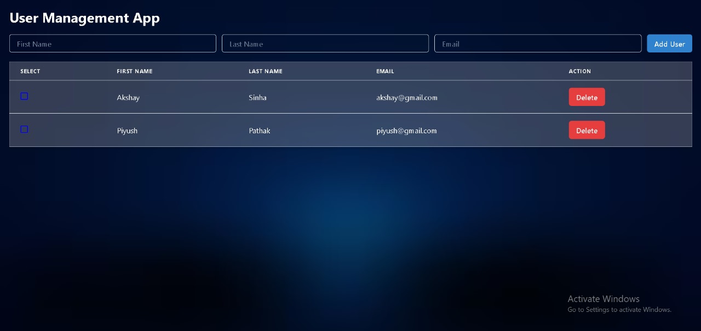
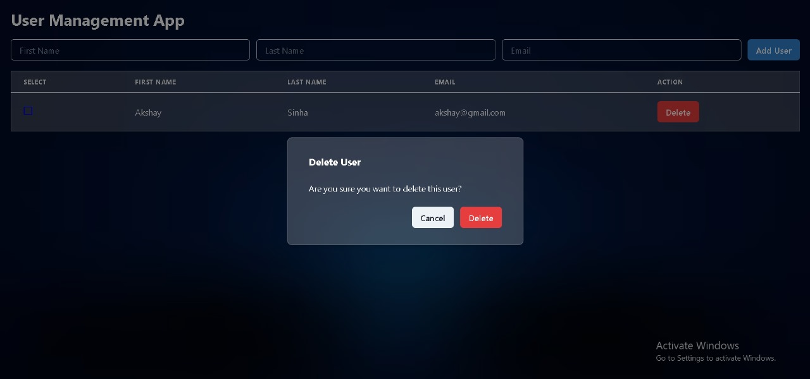

# User Management App

### Description

A simple user management application built with React and Chakra UI. The app allows you to add users with their first name, last name, and email. It features a user table where you can view, select, and delete users. The app also ensures that no duplicate emails are added.

### Features

- **Add User**: Add new users with first name, last name, and email. 
- **User Table**: View users in a table format.
- **Delete User**: Delete users with a confirmation dialog.
- **Duplicate Email Check**: Prevent adding users with duplicate emails.
- **Responsive Design**: Compatible with various screen sizes.

### Installation

1. Clone the repository:
   ```bash
   git clone https://github.com/shreya-kushwaha40/CRUD.git

2. Navigate to the project directory:
    
    cd CRUD

3. Install the dependencies:

    npm install

4. Start the development server:

    npm start

### Usage

- Add User: Fill in the first name, last name, and email in the form and click "Add User". Ensure that the email is unique.
- View Users: See the list of users in the table. Use the checkboxes to select users.
- Delete User: Click "Delete" next to a user to open a confirmation dialog. Confirm the deletion to remove the user from the list.

### Project Structure

CRUD/
├── public/
│   └── index.html
└── src/
    ├── components/
    │   ├── AddUserForm.js
    │   └── UserTable.js
    └── App.js


### User Management Application Screenshot





### Future Improvements

- Database Integration: Connect the application to a database (e.g., MongoDB, PostgreSQL) to persist user data.
- User Authentication and Authorization: Implement user authentication (e.g., using JWT or OAuth) and authorization features to manage user access and permissions. 
- Enhanced User Interface and Experience: Implement a more visual appealing user interface.

### Acknowledgments

**[Chakra UI](https://chakra-ui.com/)**: For providing a beautiful and accessible component library that greatly enhanced the user interface of this application.